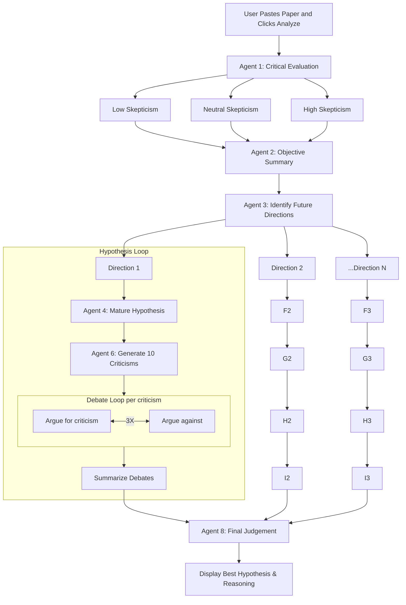

Next Best Fantastic

This is a Streamlit application powered by Anthropic Claude 3.5 Sonnet that performs end-to-end analysis of a scientific paper using a pipeline of intelligent agents. It critically evaluates, generates hypotheses, debates them, and identifies the most promising direction for future research.

⸻

How It Works

The user provides the full text of a scientific paper. The system launches a sequence of autonomous agents, each responsible for a different aspect of reasoning.

The final output is a complete audit trail of reasoning and the winning hypothesis.

⸻

🖼️ Workflow Diagram

