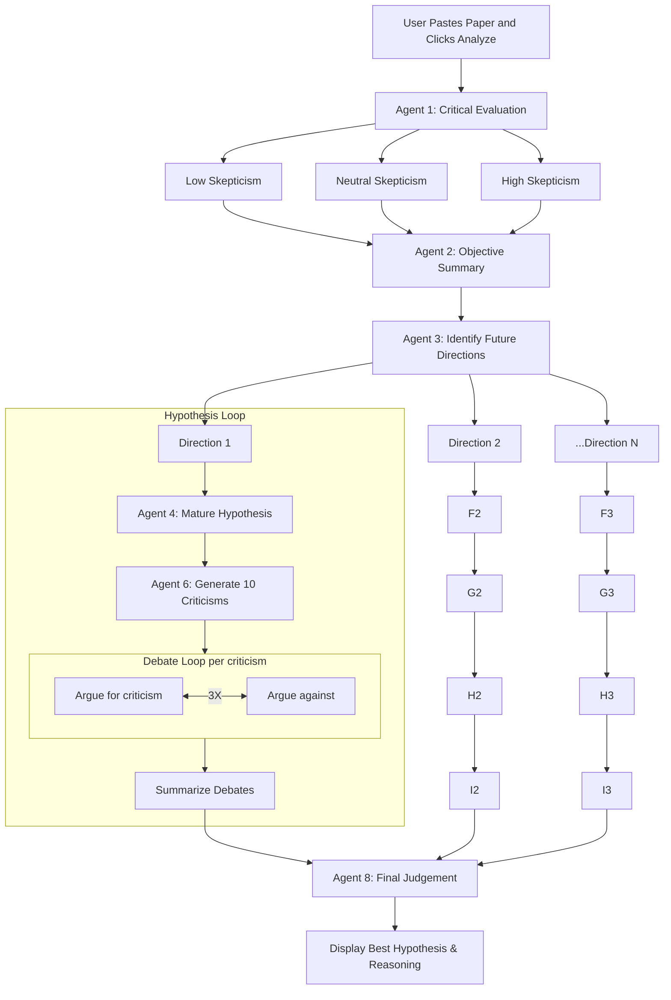

# Next Best Fantastic

This is a Streamlit application powered by Anthropic Claude 3.5 Sonnet that performs end-to-end analysis of a scientific paper using a pipeline of intelligent agents. It critically evaluates, generates hypotheses, debates them, and identifies the most promising direction for future research.


## How It Works

The user provides the full text of a scientific paper. The system launches a sequence of autonomous agents, each responsible for a different aspect of reasoning.

The final output is a complete audit trail of reasoning and the winning hypothesis.

## Prompt to generate this code
This entire code was generated in one shot (with very very minor changes outside of prompt mods) with the following prompt on Geminie 2.5 Pro Experimental
```
Create a streamlit project that hosts a chatbot:

uses claude 3.7 with tool use.

User can paste a full text of a paper.


Agent 1 is a critical evaluation agent. It can take as parameter level of 
skepticism - 3 levels - very prone to believe the paper, neutral and trying 
really hard to invalidate the paper. Run agent with all 3 levels.

Then take these results, and Agent 2 tries to get a best summary that is 
as objective as possible, without making any assumptions about the 
veracity of the source.

Agent 3 is a hypothesis master agent - it will identify 3-5 general 
directions where further hypotheses can be generated from this paper 
and this critical summary. It deploys Agent 4 for each of these directions.

Agent 4 is a hypothesis maturing agent - it will solidify the hypothesis 
provided by Agent 3 and form a clear Abstract of 500-1000 words on the hypothesis.

Agent 6 is a criticising agent that would find 5-10 criticisms on each of 
these hypotheses. For each of these criticisms, Agent 7 is launched to 
debate on it from both sides.

Agent 7 is a debate agent that can give an argument in support or in 
response to a criticism. Agent 7 should be launched in both these modes 
to duel back and forth for each criticsim above, for 3 rounds at most.

All these debates and criticisms are summarized for each hypotheses 
and passed to a judge Agent 8. Agent 8 then decides what is the best 
hypothesis to work further and why. Agent 8 should try to make sure 
this hypothesis is extremely novel and never reported or even guessed 
ideally. But it should also make sure that the hyptohesis is valid.

Then present the judgement and summary to the user.

No frameworks like langchain or langgraph
```


## Agent structure


